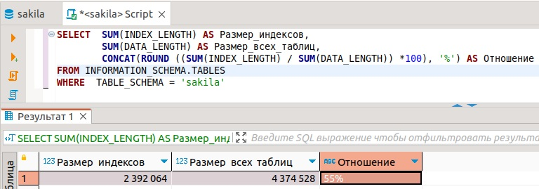
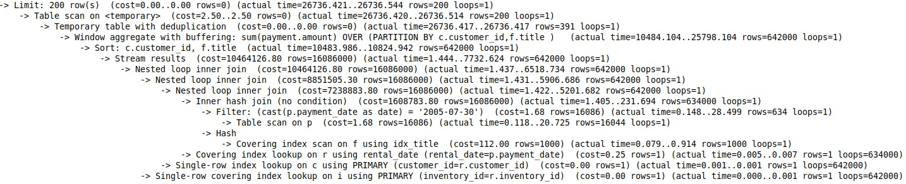
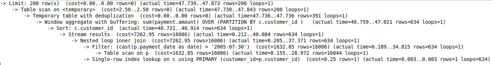

# Домашнее задание к занятию 12.5. «Индексы» - Балдин Алексей

### Задание 1

Напишите запрос к учебной базе данных, который вернёт процентное отношение общего размера всех индексов к общему размеру всех таблиц.

### Решение:
```sql
SELECT SUM(INDEX_LENGTH) AS Размер_индексов,
		SUM(DATA_LENGTH) AS Размер_всех_таблиц, 
		CONCAT(ROUND ((SUM(INDEX_LENGTH) / SUM(DATA_LENGTH)) *100), '%') AS Отношение
FROM INFORMATION_SCHEMA.TABLES
WHERE  TABLE_SCHEMA = 'sakila'
```


---

### Задание 2

Выполните explain analyze следующего запроса:
```sql
select distinct concat(c.last_name, ' ', c.first_name), sum(p.amount) over (partition by c.customer_id, f.title)
from payment p, rental r, customer c, inventory i, film f
where date(p.payment_date) = '2005-07-30' and p.payment_date = r.rental_date and r.customer_id = c.customer_id and i.inventory_id = r.inventory_id
```
- перечислите узкие места;
- оптимизируйте запрос: внесите корректировки по использованию операторов, при необходимости добавьте индексы.

### Решение:

*Очевидно, что данный запрос показывает сумму платежей клиентов за 30.07.2005 г. А для подобного расчета необходимы данные только из таблиц `payment`, `customer`. В то же время, чтение таблиц `rental`, `inventory`, `film` лишь замедлит обработку запроса. Поэтому, я считаю, что нужно их исключить, а запрос должен выглядеть так:*
```sql
select distinct concat(c.last_name, ' ', c.first_name), sum(p.amount) over (partition by c.customer_id)
from payment p, customer c
where date(p.payment_date) = '2005-07-30' and p.customer_id = c.customer_id 
```
*Для сравнения прилагаю значения вывода explain analyze по запросу, приведенного в задаче, и после его оптимизации.*

#### *Исходный запрос:*



#### *После оптимизации:*



---

## Дополнительные задания (со звёздочкой*)
Эти задания дополнительные, то есть не обязательные к выполнению, и никак не повлияют на получение вами зачёта по этому домашнему заданию. Вы можете их выполнить, если хотите глубже шире разобраться в материале.

### Задание 3*

Самостоятельно изучите, какие типы индексов используются в PostgreSQL. Перечислите те индексы, которые используются в PostgreSQL, а в MySQL — нет.

*Приведите ответ в свободной форме.*

### Решение: 

*Из того, что я нашел, это вот такая таблица-сравнение:*

| Тип индекса | MySQL | PostgreSQL |
| ----------- |:-------------:|:-------------:|
| Hash index | Только в таблицах типа Memory | Есть |
| Bitmap index | Нет | Есть |
| Partial index | Нет | Есть |
| Function based index | Нет | Есть |

